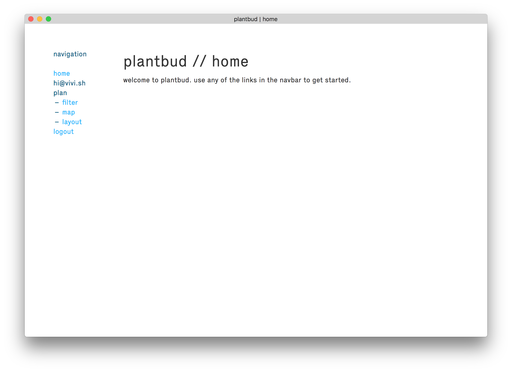
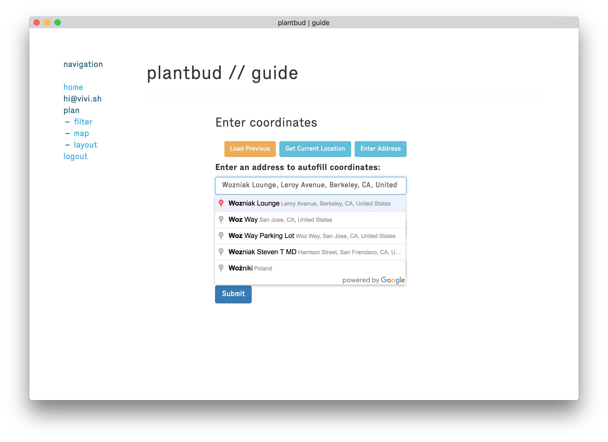
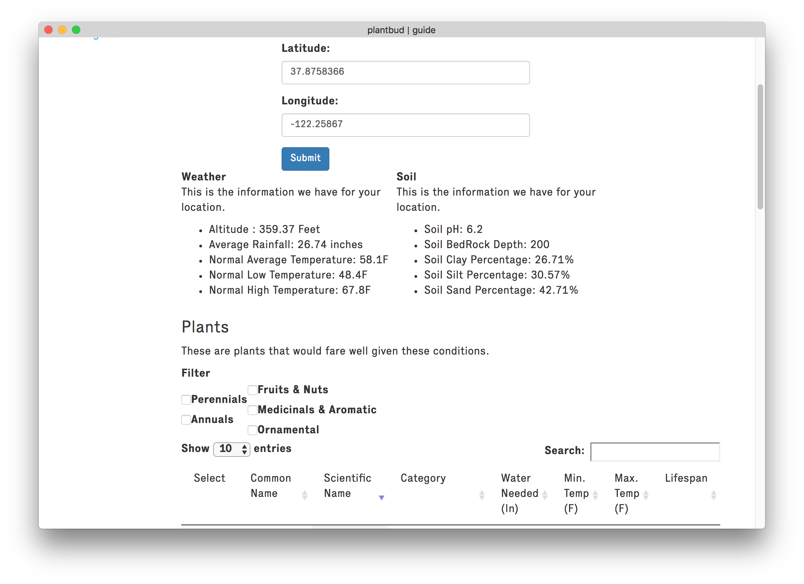
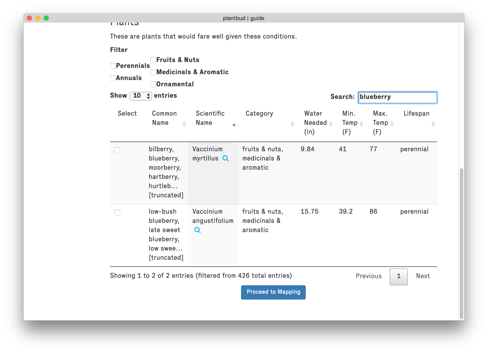
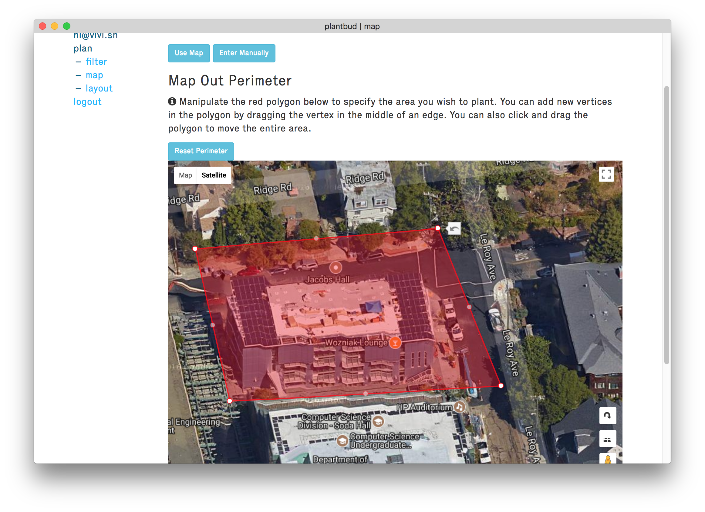
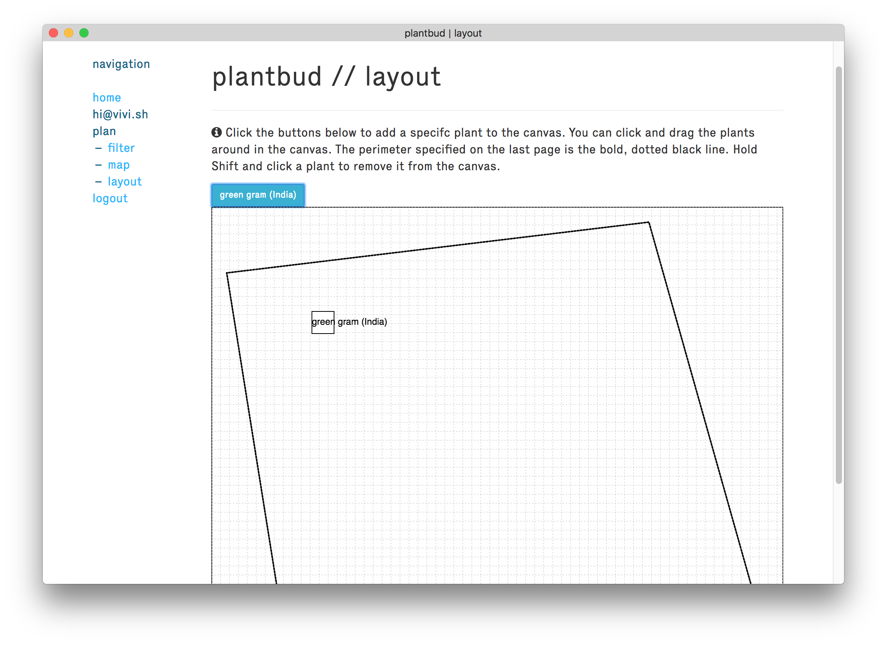

# Try it Out: [plantbud.org](https://plantbud.org)

<!-- START doctoc generated TOC please keep comment here to allow auto update -->
<!-- DON'T EDIT THIS SECTION, INSTEAD RE-RUN doctoc TO UPDATE -->
**Table of Contents**  *generated with [DocToc](https://github.com/thlorenz/doctoc)*

- [Try it Out: plantbud.org](#try-it-out-plantbudorg)
  - [Functionality](#functionality)
  - [Who's it for?](#whos-it-for)
    - [Why would anyone use this?](#why-would-anyone-use-this)
  - [Current Functionality](#current-functionality)
  - [Screenshots](#screenshots)
    - [Home](#home)
    - [Filtering](#filtering)
    - [Mapping](#mapping)
    - [Layout](#layout)

<!-- END doctoc generated TOC please keep comment here to allow auto update -->

## Functionality

plantbud is a tool that aims to make it easier to start gardening at a small
scale (e.g. urban households, community gardens). There are three components to
this project:

1. A recommender, that, based on your GPS coordinates and other parameters,
   determines what plants can grow in a given area.
2. A planner, that, based on what plants you can grow, suggests groups of plants
   that do well together or together can resolve an issue (e.g. hungry deer,
   pests)
3. An information extractor that is able to collect information about
   plants--their necessary climate decisions, how they fare with other plants,
   etc.--and organize this information in a way that can be used by
   the recommender and planner.

## Who's it for?

PlantBud is a suite of tools meant for individuals who have always wanted to
venture into agriculture but lacked the necessary expertise and resources to
dive in. Our target audience consists of individuals with very little to no
farming skills that have limited access to agriculture education. Although
PlantBud can be used by anyone interested in gardening, this software intends to
primarily cater to members of marginalized populations that face difficulty in
receiving a formal education in agriculture. This application is meant to help
those determined greenhorn planters blossom into seasoned horticulturists.

### Why would anyone use this?

Nowadays, most people that want to start gardening either take formal classes or
spend a lot of time reading relevant books/websites on proper planting
practices. This obstructs many individuals, especially those of marginalized
populations from entering the gardening world, as these people simply don't have
the resources and time to learn about gardening skills. PlantBud is meant to
streamline the learning process by providing only the relevant and necessary
information to new and inexperienced planters. 

## Current Functionality
- Can parse weather dataset from NOAA, and SoilGrids data.
- Given a set of GPS coordinates, can pull long-term rainfall and temperature
  averages of weather station closest to those coordinates, as well as soil
  quality of the area.
- Can perform basic filtering on plants in the database (currently based on
    temperature, watering needed)
- Users can perform additional filtering.
- Can map out area using Google Maps.
- Can lay out plants in that area.

## Screenshots
### Home
Log in with Google.

### Filtering
Enter an address, use your current location, or manually enter coordinates.

Weather information about your location, list of compatible plants.

Search the list of compatible plants. Select plants you want to plant.

### Mapping
Map out a perimeter.

### Layout
Lay out your selected plants.

Chris Ki ([@chriski777](https://github.com/chriski777)) and Vivian Fang
([@vivi](https://github.com/vivi)) -- CS 194-032: Computing for Social Good
